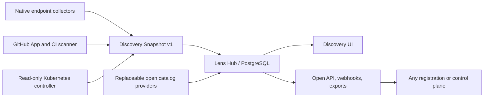

# Barrikade Lens v2

Barrikade Lens is the open-source discovery plane for autonomous agents. It finds agents, runtimes, frameworks, MCP servers, skills, models, APIs, repositories, endpoints, and deployments, then explains every finding with sanitized evidence and confidence.

Lens is intentionally the first step in the Barrikade lifecycle: **discover**. It does not register, approve, protect, block, score, or govern anything it finds.

## Run a local scan

```sh
npx barrikade-lens
```

The no-argument command opens a guided terminal interface in a TTY and emits canonical Lens JSON in automation. It works without signup or network access. Local scans do not send telemetry.

The local interface is organized for both executive review and engineering follow-up:

- **Overview** separates autonomous agents, agent-capable tools, and model runtimes; summarizes primary state; and surfaces factual conditions that need context.
- **Systems** shows root systems first, with supporting host applications and development runtimes clearly excluded from executive totals.
- **Capabilities** groups MCP servers, models, skills, tools, APIs, and workflows without expanding every API operation into the main view.
- **Coverage** explains what was checked, what failed or was unavailable, and how strong the collected evidence is.
- **Evidence graph** exposes sanitized evidence samples, human-readable relationships, and export guidance for deeper engineering analysis.

Use `1`–`5` or the left/right arrows to switch views, the up/down arrows or `j`/`k` to scroll, and `q` to leave. The layout adapts at 60, 80, and 140 columns and honors `NO_COLOR`.

“Attention” in Lens is a factual discovery queue, not a risk score. A possible-only or residual finding means the evidence needs corroboration; it does not mean the product is installed, running, vulnerable, or approved.

```sh
barrikade-lens scan --scope endpoint --format human
barrikade-lens scan --scope repo --path . --format ndjson --output lens.ndjson
barrikade-lens scan --scope repo --format cyclonedx --output agent-bom.json
barrikade-lens doctor
```

Exit code `0` means the scan completed, even if nothing was found. Exit code `2` means coverage was partial. Exit code `1` means a fatal scan or configuration failure.

Active handshakes are off by default. An explicitly allowed metadata-only probe looks like:

```sh
barrikade-lens scan --probe-url http://127.0.0.1:11434/v1/models --allow-probe-host 127.0.0.1
```

Probes reject credential-bearing URLs and metadata targets, use strict limits, and never invoke a tool.

## Organization-wide discovery

Lens Hub aggregates sources in PostgreSQL and exposes an open API, signed webhooks, Lens JSON/JSONL, CycloneDX 1.7 exports, and optional ARD declaration alignment.

For a local quickstart:

```sh
docker compose up --build
```

Open `http://localhost:8080` and use the quickstart token `lens-local-admin`. The compose credentials are deliberately development-only; use [the self-hosting guide](docs/self-hosting.md) for a real deployment.

From the Hub’s Coverage page, create a ten-minute enrollment code and run the one short command it provides:

```sh
npx barrikade-lens enroll ABCDE-FGHIJ --hub https://lens.example.com
barrikade-lens service install
```

Managed endpoint discovery performs an initial full scan, watches only known agent/configuration/skill roots, debounces relevant filesystem changes, reconciles processes and listeners every 15 minutes, and runs a jittered daily full scan. It does not install runtime hooks or capture prompts, tool calls, or commands.

System collectors inspect eligible local user profiles rather than the service account's home. Fleet deployment templates are documented in [fleet rollout](docs/fleet-rollout.md); secrets remain in the organization's MDM or secret tooling.

The Kubernetes controller is installed from `deploy/helm/lens-k8s`. Its RBAC permits read-only `get/list/watch` for workloads, Services, Ingresses, ConfigMaps, and CRD definitions. It has no Secret or pod-exec permission.

GitLab, Bitbucket, and generic pipelines use the ephemeral [CI repository scanner](docs/ci-scanning.md). The native GitHub App starts from [the supplied manifest](deploy/github-app-manifest.json).

## Architecture



- Go powers the detector engine, collectors, CLI/TUI, Kubernetes controller, Hub API, and PostgreSQL workers.
- TypeScript powers the no-download npm launcher and React Hub UI.
- PostgreSQL stores relational entities/edges plus JSONB attributes and is also the horizontally scalable job queue. There is no graph database or external queue.
- The canonical contract is [Discovery Snapshot 1.2](api/schema/discovery-snapshot-v1.json); Hub accepts 1.1 during the rolling-upgrade window. [OpenAPI](api/openapi.yaml) describes the Hub.
- Detector signatures are declarative, checksummed YAML with no executable code.
- Catalog enrichment happens only at Hub. The bundled adapter reads a compact OAK-compatible manifest and lazily fetches only matched documents.

## Declared inventory with ARD

Lens keeps publisher declarations separate from empirical observations:

- **Observed** means a collector found evidence in an endpoint, repository, or Kubernetes environment.
- **Declared** means a publisher advertised a resource in an ARD `ai-catalog.json`.
- **Observed and declared** requires an exact identifier, descriptor URL, fingerprint, or authoritative protocol identity. A matching name creates only an investigation suggestion.

Administrators add credential-free HTTPS catalog URLs from **Declarations → Declaration sources**. Hub refreshes them every six hours by default with conditional requests. Same-site nested catalogs are bounded by depth, catalog, and declaration limits. Lens records registry entries but never calls registry search endpoints, artifact URLs, agents, MCP tools, attestations, or runtime endpoints.

Repository scans recognize `.well-known/ai-catalog.json`, local `Agentmap` directives, and local HTML `rel="ai-catalog"` links without following remote references. Endpoint scans remain offline.

The Declarations page shows alignment, publisher and trust-claim facts, source freshness, evidence, and material history. Its manual export returns `ai-catalog.json` only for explicitly selected records with valid ARD identifiers, media types, and credential-free HTTPS artifact URLs. Lens does not host the exported file or invent an endpoint. See [ARD declarations and discovery](docs/ard.md).

## Repository layout

| Path | Purpose |
|---|---|
| `cmd/barrikade-lens` | Native CLI and managed endpoint service |
| `cmd/lens-hub` | Hub API and PostgreSQL workers |
| `cmd/lens-k8s` | Informer-based Kubernetes collector |
| `pkg/discovery` | Stable public discovery contract, privacy validation, identities |
| `internal/scanner` | Endpoint, repository, and Kubernetes analyzers |
| `internal/catalog` | Generic OAK/Git/file/directory capability-enrichment providers |
| `internal/ard` | Privacy-reducing ARD parser, declaration provider, and safe remote fetcher |
| `hub-ui` | Discovery-only React console |
| `npm` | npm launcher and platform packages |
| `deploy/helm` | Hub and Kubernetes Helm charts |

## Privacy contract

Lens accepts useful organizational identity—hostnames, OS users, repository/workload names, relative repository paths, and sanitized endpoint hosts—but rejects private content. Absolute paths become organization-salted hashes. URLs lose userinfo, query strings, and fragments. Configuration bodies, prompts, environment values, credentials, secret values, and full command arguments are forbidden by validation and property tests.

Read [privacy and evidence](docs/privacy.md), [data integrity and executive posture](docs/data-integrity.md), [architecture](docs/architecture.md), and the [threat model](docs/threat-model.md) before extending a detector.

Detector contributors should also read [detector packs and detection-quality rules](docs/detector-packs.md). Lens favors validated open formats and independent evidence over filename or product-name guesses: agent instructions are not agents, framework imports do not manufacture agents, supporting runtimes stay separate, and malformed descriptors are excluded from inventory.

## Build and test

Requirements are Go 1.26, Node.js 24+, npm 11+, and PostgreSQL 16+ for Hub integration tests.

```sh
go test ./...
npm ci --ignore-scripts
npm test
go build ./cmd/barrikade-lens ./cmd/lens-hub ./cmd/lens-k8s
```

Set `LENS_TEST_DATABASE_URL` to run the PostgreSQL stale/removal and tenant-isolation integration tests. Release builds use GoReleaser, generate SBOMs and checksums, and populate the platform-specific npm packages.

For a source checkout, install the local native development build once:

```sh
npm ci --ignore-scripts
npm run install:local
```

This stages the binary for the current OS and architecture, creates the local npm executable, and links `barrikade-lens` into npm's global bin directory. Afterward, both `npx barrikade-lens` and `barrikade-lens` run the checkout. Registry users do not need this step after the v2 platform packages and launcher are published.

Weekly and manually triggered scale CI enforces a two-second inventory-query gate at one million current entities. Signed artifact requirements and release secrets are described in [release integrity](docs/releasing.md).

## License and provenance

Lens is Apache-2.0. Select inventory, redaction, digest, and managed-deployment design lessons were ported from Agent Beacon under its MIT license; the notice is retained in [THIRD_PARTY_NOTICES.md](THIRD_PARTY_NOTICES.md). The bundled public catalog adapter treats its CC0 source as replaceable data and exposes source provenance as “Public API Catalog.” The pinned Apache-2.0 ARD schema revision is recorded in [schema provenance](api/schema/ARD_UPSTREAM.md).
