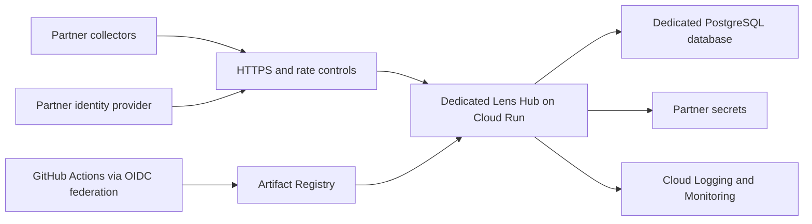

# GCP environments for design partnerships

Status: test and production foundations deployed; first `barrikade` partner stack deployed in both environments; partner sign-in and launch-readiness work remains.

## Decision

Run Lens Hub on Cloud Run with Cloud SQL for PostgreSQL. Keep test and production in separate Google Cloud projects. Treat `glossy-chimera-495407-d1` as a legacy project. Its live resources are recorded in [gcp-legacy-inventory.md](gcp-legacy-inventory.md); retirement remains a separate, explicitly approved activity.

Do not copy the Lens v1 API, BigQuery telemetry pipeline, or trained-model bucket into the new environments by default. Lens v2 does not depend on them.

The current Lens Hub schema is tenant-aware, but human OIDC sessions and GitHub App installations are assigned to the deployment's default organization. Until organization routing is implemented and independently tested, one Hub deployment must serve only one design partner. Use one stack per partner rather than placing multiple partners in a shared Hub.

## Current deployed state

| Environment | Project | Live service | Monthly budget alert | Human sign-in |
| --- | --- | --- | ---: | --- |
| Test | `barrikade-lens-test` | `https://lens-barrikade-6qbr6afqha-nw.a.run.app` | €100 | Temporary test-admin access is stored in Secret Manager; OIDC is not configured |
| Production | `barrikade-lens-prod` | Paused; its saved URL rejects public requests | €500 | Locked; no development admin token exists |

Test returns HTTP 200 from `/health`. Production preserves the same tested image digest, `sha256:108ba410cf04fe9ff4875a43449968b4e1a94c9a7cc85a65de7a38d3c925f052`, but its public access is blocked, its minimum app-instance count is zero, its health-failure alert is disabled, and its database is stopped. Each environment retains its own database, secrets, runtime identity, Terraform state, monitoring check, and release identity. The legacy project remains unchanged.

## Production pause

The production environment is paused, not deleted. Its database contents, backups, secrets, container image, network, identities, budget, and deployment records remain available for a later restart. Storage and retained-data charges continue, but always-on Cloud Run capacity and Cloud SQL compute are stopped.

Restart production in two stages: start the database while keeping the app private and scaled down, then restore public access, minimum instances, and the health alert. The Terraform README contains the exact operator procedure. Do not attempt both stages in reverse order because Lens connects to PostgreSQL while a new Cloud Run revision starts.

## Project boundary

Use three roles for projects:

| Project | Purpose | Data allowed |
| --- | --- | --- |
| Existing `glossy-chimera-495407-d1` | Legacy holding and migration source | Lens v1 service, historic telemetry, trained models |
| `barrikade-lens-test` | Integration, partner acceptance, recovery tests | Synthetic or explicitly approved partner test data |
| `barrikade-lens-prod` | Partner-facing Lens stacks | Production discovery data only |

Google recommends isolating production and non-production environments. Project separation gives Barrikade independent IAM, quotas, budgets, service identities, databases, secrets, and deletion boundaries for each environment.

Default region: `europe-west2` (London), unless a partner contract requires another data residency region. Keep Cloud Run, Cloud SQL, Artifact Registry, secrets, and logs in the same region where the service supports regional placement.

## Per-partner stack

Each partner stack contains:

- one Cloud Run Lens Hub service;
- one dedicated runtime service account;
- one PostgreSQL 18 database and database user;
- partner-specific JWT, database, OIDC, GitHub App, and webhook secrets in Secret Manager;
- partner-specific monitoring labels, alerts, and log views;
- a stable HTTPS hostname such as `<partner>.lens.barrikade.ai` in production and `<partner>.lens-test.barrikade.ai` in test.

For the first partnerships, use a dedicated Cloud SQL instance per production partner when contractual isolation is important. A lower-cost test setup may use one test instance with a separate database and user per partner. Do not share a production database user or JWT signing secret between partners.

## Cloud Run settings

Lens Hub runs database ingestion, webhook, catalog, and repository workers inside the web process. Configure always-allocated CPU and at least one minimum instance so jobs and retries continue when request traffic is idle. The application uses PostgreSQL row locks and supports multiple replicas.

Starting profile:

| Setting | Test | Production |
| --- | ---: | ---: |
| CPU / memory | 1 vCPU / 1 GiB | 1 vCPU / 1 GiB |
| Minimum instances | 1 | 2 |
| Maximum instances | 3 | 10 |
| Concurrency | 20 | 40 |
| Timeout | 40 seconds | 40 seconds |
| CPU while idle | Allocated | Allocated |

Tune these values from measured queue depth, request latency, memory, and database connections. Cap maximum instances so aggregate PostgreSQL connection pools cannot exhaust Cloud SQL.

Allow public HTTPS invocation because enrolled collectors, OIDC callbacks, and GitHub webhooks originate outside Google Cloud. Lens still authenticates protected application routes. Put the production service behind a global external Application Load Balancer and Cloud Armor before a partner launch. Restrict Cloud Run ingress to the load balancer after the load balancer path is verified.

Use `/health` for liveness only. Cloud Run reserves some paths ending in `z`, so `/healthz` remains only as a compatibility alias outside Cloud Run. Add a database-aware `/ready` endpoint before relying on readiness checks or claiming database-backed availability.

## Database

Use Cloud SQL for PostgreSQL 18 in the same region as Cloud Run. PostgreSQL 18 matches the local Lens quickstart and is supported by Cloud SQL.

Test may use a zonal, small instance with automated backups and point-in-time recovery. Production should use regional high availability, automated backups, point-in-time recovery, automatic storage growth, deletion protection, and a tested restore procedure. A backup is not considered valid until a restore into the test project succeeds.

Connect from Cloud Run through the Cloud SQL integration. The runtime identity receives `roles/cloudsql.client`; it does not receive project Editor or Owner. Store the database URL in Secret Manager and grant access to the specific secret only.

## Secrets and identities

- Create a separate runtime service account for every partner stack.
- Create separate deployment identities for test and production.
- Authenticate GitHub Actions with Workload Identity Federation; do not create downloadable service-account keys.
- Grant the deployment identity only the roles needed to publish an image and update its environment's Cloud Run service.
- Grant the runtime identity access only to its Cloud SQL instance and its specific Secret Manager secrets.
- Mount the GitHub App private key as a Secret Manager volume because Lens expects a file path.
- Pin environment-variable secrets to a version. Rotate by adding a new version and deploying a revision.
- Keep `LENS_DEV_ADMIN_TOKEN` unset outside local development.

Required application secrets and configuration:

| Name | Storage | Notes |
| --- | --- | --- |
| `LENS_DATABASE_URL` | Secret Manager | Partner-specific database and user |
| `LENS_JWT_SECRET` | Secret Manager | At least 32 random bytes; never shared across stacks |
| `LENS_OIDC_CLIENT_SECRET` | Secret Manager when required | Partner IdP application secret |
| `LENS_GITHUB_PRIVATE_KEY_FILE` | Mounted secret file | Only when GitHub discovery is enabled |
| `LENS_GITHUB_WEBHOOK_SECRET` | Secret Manager | Only when GitHub discovery is enabled |
| Public URL, organization ID/name, OIDC issuer/client ID/admin group | Cloud Run environment | Non-secret deployment configuration |

## Delivery

Publish images to regional Artifact Registry, not legacy Container Registry. Use immutable commit digests for deployment.

- Pull requests: build and test only.
- Main branch: deploy automatically to the test project.
- Production: promote the already-tested image digest after an explicit GitHub environment approval.
- Terraform: plan on pull requests; apply test after approval; apply production only from the protected production environment.

The CI identity must be restricted by GitHub repository and environment claims. Use a one-to-one relationship between deployment pipeline and service account.

## Monitoring and operations

Create alerts for:

- public uptime and TLS certificate expiry;
- Cloud Run 5xx rate, p95 latency, instance saturation, and container restarts;
- ingestion or webhook worker error logs;
- Cloud SQL CPU, memory, connections, disk use, replication/failover events, and backup failures;
- Secret Manager and IAM policy changes;
- monthly actual and forecast spend thresholds.

Budgets alert on spend; they do not cap it. Configure separate test and production budgets with thresholds at 50%, 80%, and 100%, plus forecast alerts.

Use structured logs without snapshot bodies, tokens, database URLs, OIDC codes, webhook secrets, or partner content. Set retention deliberately: a short test retention and a contract-aligned production retention. Export security/audit logs only when the receiving system and retention are agreed.

## Telemetry and historic data

Lens v1 telemetry in BigQuery is historic data. Before changing it:

1. identify dataset locations, table sizes, partitions, expiration, and last writes;
2. document whether consent and the privacy notice cover continued retention;
3. export anything that must be retained to a restricted archive;
4. revoke writers and stop ingestion;
5. set a deletion date only after business and legal confirmation.

Beacon telemetry is customer-controlled by product design. Do not silently route partner Beacon events into Barrikade's legacy BigQuery dataset. If Barrikade operates storage for a design partner, use a partner-specific bucket or dataset, explicit retention, documented access, and a separate writer identity.

The trained-model bucket is not part of Lens v2. Preserve it read-only until object inventory, ownership, license, provenance, checksum, and last-access checks are complete. Then either move retained artifacts to a versioned archive bucket or delete them through a separately approved retirement plan.

## Launch gates

A production partner stack is ready only when all of these pass:

- test and production projects have independent IAM and budgets;
- image promotion uses an immutable digest and GitHub OIDC federation;
- `LENS_DEV_ADMIN_TOKEN` is absent;
- partner OIDC login and admin-group behavior are verified;
- enrollment, token rotation, ingestion, inventory queries, exports, and webhook delivery pass;
- cross-partner access tests fail closed;
- backup restore succeeds into test and the recovery time is recorded;
- uptime, application, database, and billing alerts reach a monitored channel;
- the data-flow, subprocessors, region, retention, deletion, incident contact, RPO, and RTO are recorded for the partner;
- the legacy project remains unchanged or has a separately approved retirement record.

## Inputs still required before a partner launch

- partner identity-provider issuer, client ID, redirect URI, and admin group;
- DNS provider and approval of the proposed `*.lens-test.barrikade.ai` and `*.lens.barrikade.ai` naming;
- monitored recipients for uptime and application alerts;
- agreed data retention, recovery-point objective, and recovery-time objective;
- whether GitHub App discovery is required for the first pilot;
- a successful production-login test and a production database restore test.

## References

- [Google Cloud environment isolation guidance](https://docs.cloud.google.com/docs/enterprise/cloud-setup)
- [Cloud Run security](https://docs.cloud.google.com/run/docs/securing/security)
- [Cloud Run public access](https://docs.cloud.google.com/run/docs/authenticating/public)
- [Cloud Run known issues and reserved paths](https://docs.cloud.google.com/run/docs/known-issues)
- [Cloud Run minimum instances and billing](https://docs.cloud.google.com/run/docs/configuring/min-instances)
- [Connect Cloud Run to Cloud SQL for PostgreSQL](https://docs.cloud.google.com/sql/docs/postgres/connect-run)
- [Cloud SQL high availability](https://docs.cloud.google.com/sql/docs/postgres/high-availability)
- [Cloud SQL PostgreSQL versions](https://docs.cloud.google.com/sql/docs/postgres/db-versions)
- [Cloud Run secrets](https://docs.cloud.google.com/run/docs/configuring/services/secrets)
- [Workload Identity Federation for deployment pipelines](https://docs.cloud.google.com/iam/docs/workload-identity-federation-with-deployment-pipelines)
- [Artifact Registry transition guidance](https://docs.cloud.google.com/artifact-registry/docs/transition/transition-from-gcr)
- [Cloud Billing budgets](https://docs.cloud.google.com/billing/docs/how-to/budgets)
